[简体中文](README.md) | **English**

<picture>
  <source media="(max-width: 640px) and (prefers-color-scheme: dark)" srcset="assets/presentation/hero-mobile-dark.svg">
  <source media="(max-width: 640px)" srcset="assets/presentation/hero-mobile-light.svg">
  <source media="(prefers-color-scheme: dark)" srcset="assets/presentation/hero-dark.svg">
  
</picture>

**BranchTree stores chapters, branches and character facts in a local story tree so you can try alternate continuations, retain old drafts and inspect explicit contradictions.**

`Python 3.12+` · [MIT](LICENSE) · [GitHub](https://github.com/SuperMarioYL/branchtree) · [Website](https://branchtree.lei6393.com)

## Why it helps

Changing a turning point need not overwrite every later draft. A story tree keeps chapter parent links separate from each branch’s active ending, letting the author compare continuations before promoting one to the main line. Fact locks provide references for the checker; they do not guarantee automatic consistency.

<picture>
  <source media="(max-width: 640px) and (prefers-color-scheme: dark)" srcset="assets/presentation/process-mobile-dark.svg">
  <source media="(max-width: 640px)" srcset="assets/presentation/process-mobile-light.svg">
  <source media="(prefers-color-scheme: dark)" srcset="assets/presentation/process-dark.svg">
  
</picture>

## Architecture

StoryTree in tree.py owns ChapterNode, Branch and Lock. add_chapter connects text to a parent and advances active_tip. state.py records text length and mentions of known character names. consistency.py checks a limited set of explicit Chinese negation patterns; render_html.py exports static HTML. Model regeneration and deep extraction in llm.py remain unimplemented.

<picture>
  <source media="(max-width: 640px) and (prefers-color-scheme: dark)" srcset="assets/presentation/architecture-mobile-dark.svg">
  <source media="(max-width: 640px)" srcset="assets/presentation/architecture-mobile-light.svg">
  <source media="(prefers-color-scheme: dark)" srcset="assets/presentation/architecture-dark.svg">
  
</picture>

## Install

Requires Python 3.12+. Dependency installation may need network access; the tree operations and checks below do not call a model.

```bash
git clone https://github.com/SuperMarioYL/branchtree.git
cd branchtree
python3 -m venv .venv
source .venv/bin/activate
python -m pip install -e .
```

## Quickstart

```bash
python examples/presentation_demo.py
```

The example creates three chapters, forks alternate from ch1, and says Lin Wan has no scar in ch3. The checker reports one contradiction with the pinned scar fact. After merging, main points to ch3 while ch1, ch2 and ch3 remain. JSON reload validates and static HTML is written; temporary files are removed afterward.

## Usage

```bash
# Work in a separate story directory
mkdir my-story
cd my-story
branchtree new serial
branchtree lock add character:林晚 --facts "左手有疤"
branchtree add --text "林晚醒来，左手有疤。"
branchtree branch --from ch1 --name alternate
branchtree add --text "林晚左手没有疤。" --branch alternate
branchtree consistency
branchtree view --no-browser
branchtree merge --branch alternate --into main
```

merge relabels branch nodes, advances the destination tip and removes the branch record. It does not merge prose line by line or automatically reject contradictory chapters.

## Capabilities and integrations

| Input/output | Current support |
|---|---|
| Chapter text | --text or UTF-8 --file |
| Persistence | <name>.tree/tree.json |
| Character facts | lock add / lock list |
| Reading view | Static HTML with optional browser opening |
| Python | StoryTree, Lock and checker APIs |

<picture>
  <source media="(max-width: 640px) and (prefers-color-scheme: dark)" srcset="assets/presentation/integrations-mobile-dark.svg">
  <source media="(max-width: 640px)" srcset="assets/presentation/integrations-mobile-light.svg">
  <source media="(prefers-color-scheme: dark)" srcset="assets/presentation/integrations-dark.svg">
  
</picture>

## Configuration and limits

The CLI loads the first name-sorted *.tree directory in its current directory, so keep one story tree per working directory. Locks default to tree scope and accept semicolon-separated facts.

Consistency rules inspect chapters mentioning the target name and match limited negation fragments. They do not understand metaphor, motivation or a complete timeline; no finding is not proof that the text is correct. The consistency CLI currently reports violations without a nonzero exit status; automation should consume the Python checker’s Violation list.

regenerate and deep state extraction still raise NotImplementedError. Configuring an endpoint or API key does not activate them.

## Recorded demo

v0.1.0 performs real tree operations, persistence and HTML export on three constructed chapters. A rule hit is not a proof of consistency for a whole novel.

[Inputs, commands and complete output](docs/demo-results.json)

[Retained terminal recording](assets/demo.gif) · [Recording script](docs/demo.tape). The replayable record above describes this example.

## Roadmap

- [x] Chapter trees, forks, branch promotion and JSON persistence.
- [x] Fact-lock records, rule-based contradiction checks and static HTML.
- [ ] Model-assisted regeneration and deep state extraction.
- [ ] Cloud synchronization and collaboration.

There is no hosted plan or purchase flow in this version; unimplemented items are directions only.

## Development and license

```bash
python -m pip install -e ".[dev]"
python -m pytest
```

See [tree.py](src/branchtree/tree.py) for the format and [consistency.py](src/branchtree/consistency.py) for rules.

[MIT](LICENSE) · [Issues](https://github.com/SuperMarioYL/branchtree/issues)
