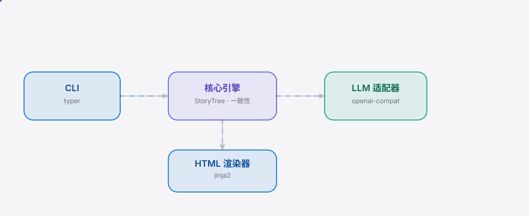

<div align="right"><sub>[English](./README.en.md) | <b>简体中文</b></sub></div>

<picture>
  <source media="(prefers-color-scheme: dark)" srcset="./assets/hero-dark.svg">
  <source media="(prefers-color-scheme: light)" srcset="./assets/hero-light.svg">
  
</picture>

<p align="center"><sub>BranchTree 是跨章锁定角色/设定一致性的网文连载故事树 agent，本地运行。</sub></p>

<p align="center">
  <a href="./LICENSE"></a>
  <a href="https://github.com/SuperMarioYL/branchtree/releases"></a>
  <a href="https://github.com/SuperMarioYL/branchtree/actions/workflows/ci.yml"></a>
  
</p>

**连载写到第 200 章，角色的眼色和第 12 章矛盾了？把故事当树——分支重绘支线，锁定角色事实，一致性跨章不崩。**

<h2> 架构</h2>

<picture>
  <source media="(prefers-color-scheme: dark)" srcset="./assets/atlas-dark.svg">
  <source media="(prefers-color-scheme: light)" srcset="./assets/atlas-light.svg">
  
</picture>

单进程 CLI，无微服务、无运行中 server。CLI (typer) 调用 Core (pydantic 纯逻辑)，Core 负责故事树 / 状态 / 一致性检查器，LLM 适配器走 openai-compat 接 DeepSeek/豆包/Kimi，渲染器用 jinja2 生成静态 HTML。

## 目录

- [为什么需要 BranchTree](#为什么需要-branchtree)
- [安装与快速开始](#安装与快速开始)
- [用法](#用法)
- [Demo](#demo)
- [配置](#配置)
- [路线图](#路线图)
- [付费](#付费)
- [协议](#协议)

## 为什么需要 BranchTree

网文连载写到 200 章时，角色第 12 章的眼色和第 180 章矛盾；第 30 章的伏笔到第 200 章被遗忘；书评区读者用「设定崩」「人物前后矛盾」作为弃书理由。通用 LLM 聊天无持久叙事状态，跨章全靠手贴前文，多写一版就覆盖旧版。BranchTree 把叙事状态落盘成可分叉的工程文件——regenerate 时 lock 强制不可变，一致性跨百万字不崩。

<h2> 安装与快速开始</h2>

```bash
git clone https://github.com/SuperMarioYL/branchtree.git && cd branchtree
uv tool install -e .
cd examples/demo-serial && branchtree view   # 浏览器打开 30 章树视图
```

<details>
<summary>查看示例输出</summary>

```
已渲染树视图 → demo-serial.tree/tree.html
用浏览器打开: file:///.../demo-serial.tree/tree.html
```

浏览器中可看到主线 30 章 + alt-take 分支 3 章，以及角色锁（林晚：左手有疤、恨哥哥）。

</details>

> 国内用户可在 [Gitee 镜像](https://gitee.com/SuperMarioYL/branchtree) 克隆，速度更快。

<h2> 用法</h2>

**创建故事树并追加章节：**

```bash
branchtree new myserial
branchtree add --text "第一章 林晚睁开眼，左手上的疤痕隐隐作痛。"
branchtree add --file ch02.txt
```

**锁定角色事实（跨重绘不可变）：**

```bash
branchtree lock add character:林晚 --facts "左手有疤;恨哥哥"
branchtree lock list
```

**分叉支线并合并最佳版本：**

```bash
branchtree branch --from ch12 --name alt-take
branchtree add --text "林晚决定先动手。" --branch alt-take
branchtree view                    # 主线 / alt-take 并列显示
branchtree merge --branch alt-take --into main
```

**跨章一致性校验：**

```bash
branchtree consistency   # 检测设定崩，报告违规点位
```

<h2> Demo</h2>


对 30 章 demo 连载执行 branch + merge + view，分支结构与锁定状态在静态 HTML 中可视化。

<h2> 配置</h2>

LLM 相关功能（regenerate / 深度状态抽取，m2 里程碑）通过环境变量配置：

| 变量 | 说明 | 默认值 |
|---|---|---|
| `OPENAI_BASE_URL` | openai-compat 端点（DeepSeek/豆包/Kimi） | 无 |
| `OPENAI_API_KEY` | API 密钥 | 无 |
| `BRANCHTREE_MODEL` | 模型名称 | `deepseek-chat` |

m1 不需要 LLM——故事树落盘、分支、合并、静态 HTML 视图全部本地运行。

<h2> 路线图</h2>

- [x] **m1 故事树原语** — 可分叉故事树落盘 + 静态 HTML 视图（无 LLM）
- [ ] **m2 循环内控制** — regenerate-this-branch + lock-character 一致性校验，对 30 章 demo 可演示
- [ ] **m3 安装即用** — uv/pipx 10 分钟安装 + 双语 README + demo GIF，陌生人可复现

未来：hosted 云同步（跨设备编辑 + 百万字级一致性图谱）、工作室协同分支/锁。

<h2> 付费</h2>

v0.1 完全免费、本地运行、开源（MIT），无任何付费墙。后续 hosted 版本规划：

| 套餐 | 价格 | 功能 |
|---|---|---|
| 个人 hosted | ¥19/月 | 云同步故事树 + 跨设备续写 + 百万字级一致性图谱 |
| 工作室 | ¥99/月/席位 | 共享分支/锁协同，5 席位起 |

付费功能在 m3 上线 + 30 天 kill-gate 通过后启动。本地 OSS 版本永久免费。

## 协议

[MIT](./LICENSE) © 2026 SuperMarioYL。欢迎在 [GitHub Issues](https://github.com/SuperMarioYL/branchtree/issues) 提交 bug 或功能建议。

<p align="center"><sub><a href="./LICENSE">MIT</a> © 2026 SuperMarioYL</sub></p>
